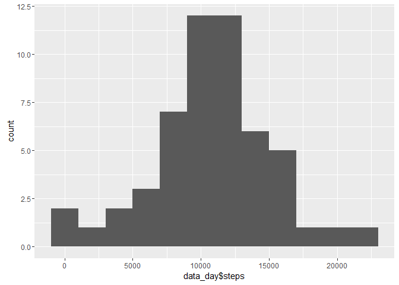
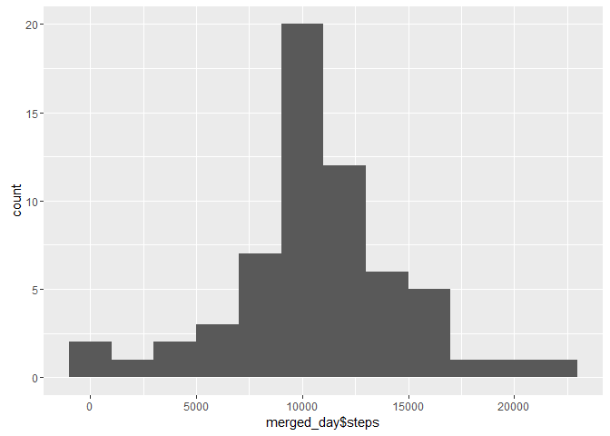
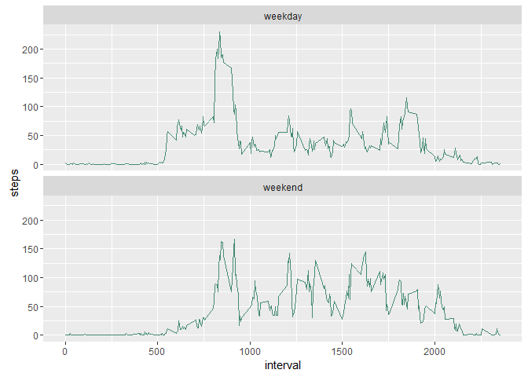

# Reproducible Research: Peer Assessment 1

## Loading and preprocessing the data

First some libraries are loaded. Then the activity.csv file (already unzipped) is read. The date column is formatted into the R date format for easier processing.


```r
library(plyr)
library(dplyr)
```

```
## 
## Attaching package: 'dplyr'
```

```
## The following objects are masked from 'package:plyr':
## 
##     arrange, count, desc, failwith, id, mutate, rename, summarise,
##     summarize
```

```
## The following objects are masked from 'package:stats':
## 
##     filter, lag
```

```
## The following objects are masked from 'package:base':
## 
##     intersect, setdiff, setequal, union
```

```r
library(ggplot2)
library(data.table)
```

```
## 
## Attaching package: 'data.table'
```

```
## The following objects are masked from 'package:dplyr':
## 
##     between, last
```

```r
input <- read.csv(file="activity.csv",header=TRUE,sep=",")
data <- input
data$date <- as.Date(data$date)
```

## What is mean total number of steps taken per day?

We use dplyr to get the total number of steps per day and ggplot2 to plot an histogram. Afterwards the mean and median number of steps per day are computed.


```r
data_day <- data %>% 
    group_by(date) %>% 
    summarise(steps = sum(steps))

ggplot(data=data_day, aes(data_day$steps)) + geom_histogram(binwidth = 2000)
```

```
## Warning: Removed 8 rows containing non-finite values (stat_bin).
```

<!-- -->

```r
mean(data_day$steps, na.rm = TRUE)
```

```
## [1] 10766.19
```

```r
median(data_day$steps, na.rm = TRUE)
```

```
## [1] 10765
```

## What is the average daily activity pattern?

Next we create a time series plot of the 5-minute interval (x-axis) and the average number of steps taken, averaged across all days (y-axis).


```r
data_interval <- data %>% 
    group_by(interval) %>% 
    summarise(steps = mean(steps, na.rm = TRUE))

ggplot(data=data_interval, aes(interval, steps)) + geom_line()
```

<!-- -->

```r
data_interval <- as.data.table(data_interval)
data_interval[, .SD[which.max(steps)]]
```

```
##    interval    steps
## 1:      835 206.1698
```

As shown the interval with the maximum number of steps is 835.

## Imputing missing values


The total number of missing values in the dataset is now calculated. We check that there are only missing values in the steps column.


```r
nrow(data[is.na(data$steps),])
```

```
## [1] 2304
```

```r
nrow(data[is.na(data$date),])
```

```
## [1] 0
```

```r
nrow(data[is.na(data$interval),])
```

```
## [1] 0
```

Since there are days with no values at all, we choose to replace the NAs with the mean for that 5-minute interval.


```r
data_interval <- plyr::rename(data_interval, c("steps" = "mean_steps"))
merged <- merge(data, data_interval, by = "interval")
merged$steps[is.na(merged$steps)] <- merged$mean_steps[is.na(merged$steps)]
merged$mean_steps <- NULL
```

We make an histogram and compute the mean and median.


```r
merged_day <- merged %>% 
    group_by(date) %>% 
    summarise(steps = sum(steps))

ggplot(data=merged_day, aes(merged_day$steps)) + geom_histogram(binwidth = 2000)
```

<!-- -->

```r
mean(merged_day$steps, na.rm = TRUE)
```

```
## [1] 10766.19
```

```r
median(merged_day$steps, na.rm = TRUE)
```

```
## [1] 10766.19
```

We can see that the difference between these values and the ones calculated previously is negligible.


## Are there differences in activity patterns between weekdays and weekends?


```r
merged$weekday <- weekdays(merged$date)
merged$weekfactor <- "weekday"
merged$weekfactor[merged$weekday == "Saturday"] <- "weekend"
merged$weekfactor[merged$weekday == "Sunday"] <- "weekend"
merged$weekfactor <- as.factor(merged$weekfactor)
```

The results are plotted.


```r
merged_interval <- merged %>% 
    group_by(interval, weekfactor) %>% 
    summarise(steps = sum(steps))

ggplot(merged_interval, aes(interval,steps))+geom_line(color="aquamarine4")+facet_wrap(~weekfactor, nrow=2)
```

<!-- -->


